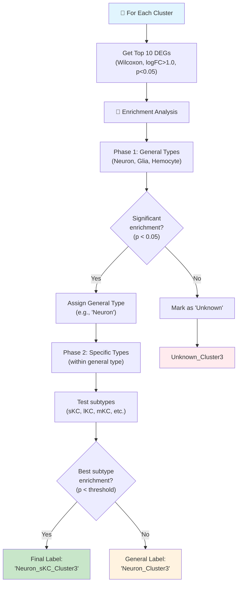

# Cell Type Annotation for Bee Brain Spatial Data

A comprehensive toolkit for annotating cell types in enhanced spatial transcriptomics data using literature-curated marker genes.

## 🎯 Overview

This toolkit provides **best practices** for cell type annotation in spatial transcriptomics data, specifically designed for bee brain analysis but adaptable to other systems.

### Key Features

- **Statistical Enrichment-Based Annotation**: NEW! Cluster-level annotation using hypergeometric tests
- **Marker Gene-Based Scoring**: Multiple scoring methods (mean, median, scanpy)  
- **Hierarchical Assignment**: General → Specific cell type annotation
- **Confidence-Based Assignment**: Prevents over-confident assignments
- **Spatial Validation**: Ensures assignments make anatomical sense
- **Comprehensive Visualization**: UMAP, spatial, and statistical plots
- **Quality Control**: Built-in QC metrics and recommendations

## 🧮 **NEW: Statistical Enrichment Approach**

### **Why This Approach is Superior**

The traditional single-cell marker scoring can be noisy and lead to spatially incoherent results. Our new **cluster-based statistical enrichment** approach:

1. **Finds top DEGs per cluster** (robust, data-driven)
2. **Tests enrichment with marker lists** (statistically rigorous)  
3. **Assigns labels hierarchically** (general → specific types)
4. **Maintains cluster identity** (better spatial coherence)

### **Statistical Enrichment Workflow**



### **Hypergeometric Test Explained**

The enrichment test answers: **"Is this overlap statistically significant?"**

```python
# Example: Cluster has 10 top DEGs, 4 match "Neuron" markers
# Question: Is 4/10 significantly enriched for neuron markers?

from scipy.stats import hypergeom

N = 15000  # Total genes in dataset
K = 25     # Available neuron markers in dataset  
n = 10     # Top DEGs per cluster
x = 4      # Matches found

# P-value: probability of ≥4 matches by chance
p_value = hypergeom.sf(x-1, N, K, n)

# Low p-value (e.g., <0.05) = significant enrichment!
```

### **Usage: Cluster-Based Enrichment**

```python
from cell_type_annotation import BeebrainCellTypeAnnotator
import scanpy as sc

# Load enhanced spatial data
adata = sc.read_h5ad("your_enhanced_data.h5ad")

# Initialize with Excel marker file (hierarchical)
annotator = BeebrainCellTypeAnnotator(
    adata, 
    marker_file="bee_brain_markers.xlsx",
    annotation_level="general_type",  # or "specific_type"
    selected_types=["Neuron", "Glia", "Hemocyte"]
)

# NEW: Statistical enrichment-based cluster annotation
cluster_assignments = annotator.annotate_clusters_with_enrichment(
    cluster_col='clusters',    # Your cluster column
    min_logfc=1.0,            # DEG fold-change threshold
    max_pval=0.05,            # DEG p-value threshold  
    min_overlap=2,            # Minimum overlapping genes
    n_top_genes=10            # Top DEGs per cluster
)

# Results: 
# cluster_assignments = {
#     '0': 'Neuron_sKC_Cluster0',
#     '1': 'Neuron_lKC_Cluster1', 
#     '2': 'Glia_Astrocyte_Cluster2',
#     '3': 'Unknown_Cluster3'
# }

# Visualize enrichment results
annotator.plot_cluster_enrichment_heatmap(save_path="enrichment_heatmap.png")

# Cell-level assignments are automatically added to adata.obs['cluster_celltype']
```

### **Advantages of This Approach**

| Traditional Single-Cell | **NEW Cluster-Based Enrichment** |
|-------------------------|-----------------------------------|
| ❌ Noisy individual cell scores | ✅ Robust cluster-level signals |
| ❌ Poor spatial coherence | ✅ Excellent spatial coherence |
| ❌ Arbitrary confidence thresholds | ✅ Statistical significance testing |
| ❌ No marker validation | ✅ Uses actual DEGs from your data |
| ❌ Single annotation level | ✅ Hierarchical (general→specific) |

### **When to Use Which Approach**

- **Cluster-based enrichment** (recommended): Well-clustered data, spatial coherence important
- **Traditional scoring**: Poorly clustered data, continuous annotation needed, single-cell resolution critical

## 📁 Files in this Directory

- `cell_type_annotation.py` - Main annotation toolkit class with **NEW statistical enrichment methods**
- `enrichment_annotation_example.py` - **NEW! Complete example using statistical enrichment**
- `cell_type_annotation_run.py` - User-friendly runner script with CONFIG section
- `annotation_workflow_example.py` - Traditional single-cell scoring example
- `compare_clustering_annotation.py` - Compare annotation results with existing clusters
- `plot_spatial_annotations.py` - Spatial plotting with copy-paste CONFIG
- `README_Annotation.md` - This comprehensive documentation

## 🚀 Quick Start

### **Method 1: Statistical Enrichment (Recommended)**

```python
from cell_type_annotation import BeebrainCellTypeAnnotator, create_advanced_marker_template
import scanpy as sc

# Step 1: Create marker template (first time only)
create_advanced_marker_template("bee_brain_markers.xlsx", format='excel')
# Edit the Excel file with your literature-curated markers!

# Step 2: Load your enhanced spatial data  
adata = sc.read_h5ad("your_enhanced_data.h5ad")

# Step 3: Initialize annotator with hierarchical markers
annotator = BeebrainCellTypeAnnotator(
    adata,
    marker_file="bee_brain_markers.xlsx",
    annotation_level="general_type",      # Start with broad categories
    selected_types=["Neuron", "Glia", "Hemocyte"]
)

# Step 4: NEW! Statistical enrichment-based annotation
cluster_assignments = annotator.annotate_clusters_with_enrichment(
    cluster_col='clusters',               # Your existing clusters  
    min_logfc=1.0,                       # DEG requirements
    max_pval=0.05,                       
    min_overlap=2,                       # Min genes overlapping
    n_top_genes=10                       # Top DEGs per cluster
)

# Step 5: Visualize results
annotator.plot_cluster_enrichment_heatmap(save_path="enrichment_results.png")

# Your results are in:
# - adata.obs['cluster_celltype'] (cell-level assignments)
# - cluster_assignments (cluster-level dictionary)
```

### **Method 2: Traditional Single-Cell Scoring**

```python
# Load your enhanced spatial data
adata = sc.read_h5ad("your_enhanced_data.h5ad")

# Initialize annotator with your marker genes
annotator = BeebrainCellTypeAnnotator(adata, marker_genes=your_markers)

# Check marker availability
annotator.check_marker_availability()

# Score and assign cell types
annotator.score_cell_types(method='mean_expression')
annotator.assign_cell_types(confidence_threshold=0.1)

# Visualize results
annotator.plot_comprehensive_annotation_results()

# Save annotated data
annotator.save_annotations("annotated_data.h5ad")
```

### **Method 3: Complete Workflow with Runner Script**

```bash
cd /path/to/your/p5_SvsF/code/annotation

# Edit the CONFIG section in cell_type_annotation_run.py with your paths
python cell_type_annotation_run.py
```

### **Method 4: Statistical Enrichment Example Script**

```bash
cd /path/to/your/p5_SvsF/code/annotation

# Edit paths in enrichment_annotation_example.py and run
python enrichment_annotation_example.py
```

This script provides a complete step-by-step workflow with detailed explanations!

## 📝 **Creating Your Marker Gene File**

### **Excel Template Structure**

The new approach uses hierarchical marker files with this structure:

| gene_id | gene_name_alias | gene_description | general_type | specific_type |
|---------|----------------|------------------|--------------|---------------|
| LOC408134 | elav | embryonic lethal abnormal vision | Neuron | Pan_Neuronal |
| LOC413265 | mb247 | mushroom body marker 247 | Neuron | Kenyon_Cells |
| LOC412655 | repo | reversed polarity | Glia | Astrocyte_like |

### **Generate Template**

```python
from cell_type_annotation import create_advanced_marker_template

# Create Excel template
create_advanced_marker_template("my_markers.xlsx", format='excel')

# Or CSV format  
create_advanced_marker_template("my_markers.csv", format='csv')
```

### **Hierarchical Annotation Levels**

- **`general_type`**: Broad categories (Neuron, Glia, Hemocyte)
- **`specific_type`**: Detailed subtypes (sKC, lKC, Astrocyte_like, etc.)

Choose annotation level when initializing:
```python
# Broad annotation
annotator = BeebrainCellTypeAnnotator(adata, marker_file="markers.xlsx", 
                                     annotation_level="general_type")

# Detailed annotation  
annotator = BeebrainCellTypeAnnotator(adata, marker_file="markers.xlsx",
                                     annotation_level="specific_type")
```

## 📚 Best Practices for Cell Type Annotation

### **1. Marker Gene Selection**

#### Literature Review Strategy:
- **Start broad, go specific**: Begin with pan-neuronal markers, then refine to subtypes
- **Multiple sources**: Cross-reference multiple papers and databases
- **Validation studies**: Prefer markers validated in multiple studies
- **Species consideration**: Prioritize bee/insect studies over Drosophila when possible

#### Quality Criteria:
- **Specificity**: Genes expressed in one cell type but not others
- **Sensitivity**: Expressed in most/all cells of that type
- **Reliability**: Consistent expression across conditions
- **Availability**: Present in your dataset (check with `check_marker_availability()`)

### **2. Scoring Methods**

| Method | Best For | Pros | Cons |
|--------|----------|------|------|
| `mean_expression` | Initial screening | Fast, interpretable | Sensitive to outliers |
| `median_expression` | Robust scoring | Outlier-resistant | Less sensitive |
| `scanpy_score` | Publication-quality | Normalized, comparable | More complex |

**Recommendation**: Start with `mean_expression`, validate with `scanpy_score`

### **3. Assignment Strategies**

#### Confidence Thresholds:
- **Conservative (0.2-0.5)**: Fewer assignments, higher confidence
- **Moderate (0.1-0.2)**: Balanced assignments
- **Liberal (0.05-0.1)**: More assignments, lower confidence

#### Quality Control:
```python
# Check unassigned percentage
unassigned_pct = (adata.obs['cell_type_assignment'] == 'Unassigned').sum() / len(adata) * 100

if unassigned_pct > 50:
    print("Consider lowering confidence threshold or adding more markers")
elif unassigned_pct < 5:
    print("Consider raising confidence threshold to avoid over-assignment")
```

### **4. Spatial Validation**

#### Anatomical Coherence:
- **Regional enrichment**: Cell types should cluster in expected brain regions
- **Spatial continuity**: Similar cell types should be spatially adjacent
- **Known anatomy**: Validate against established bee brain atlases

#### Validation Questions:
- Do Kenyon cells cluster in the mushroom body region?
- Are olfactory neurons enriched in antennal lobe areas?
- Do visual system markers appear in optic lobe regions?

### **5. Hierarchical Annotation Strategy**

```python
# Level 1: Broad categories
broad_markers = {
    'Neurons': ['elav', 'nSyb', 'Syt1'],
    'Glia': ['repo', 'Gs2', 'Eaat1'],
    'Hemocytes': ['Hml', 'srp', 'gcm']
}

# Level 2: Neuronal subtypes  
neuron_markers = {
    'Kenyon_Cells': ['mb247', 'FasII', 'OK107'],
    'Projection_Neurons': ['GH146', 'Mz19', 'NP225'],
    'Local_Neurons': ['Gad1', 'VGlut', 'ChAT']
}

# Level 3: Specific subtypes
KC_markers = {
    'sKC': ['mb247', 'FasII', 'arm', 'Lac'],
    'lKC': ['mb247', 'FasII', 'VGlut', 'ChAT'],
    'mKC': ['mb247', 'FasII', 'Synapsin', 'VGlut']
}
```

## 🔬 Scientific Workflow

### **Step 1: Data Quality Assessment**
```python
# Check data characteristics
annotator._validate_data()

# Assess marker availability
availability = annotator.check_marker_availability()
```

### **Step 2: Initial Annotation**
```python
# Score with multiple methods
annotator.score_cell_types(method='mean_expression', score_name_suffix='_mean')
annotator.score_cell_types(method='scanpy_score', score_name_suffix='_scanpy')

# Conservative assignment
annotator.assign_cell_types(confidence_threshold=0.2)
```

### **Step 3: Quality Control**
```python
# Generate comprehensive plots
annotator.plot_comprehensive_annotation_results()

# Check spatial coherence
# (Manual inspection of spatial plots)

# Review assignment summary
summary = annotator.get_annotation_summary()
print(summary)
```

### **Step 4: Refinement**
```python
# Adjust parameters based on QC
annotator.assign_cell_types(confidence_threshold=0.15)  # Adjusted threshold

# Re-evaluate results
annotator.plot_spatial_annotations()
```

### **Step 5: Validation**
- Compare with existing clustering results
- Validate against known bee brain anatomy
- Check for biological plausibility
- Cross-reference with literature

## 📊 Output Files

After running the annotation workflow, you'll get:

```
annotation_results/
├── score_distributions.png           # Distribution of cell type scores
├── umap_cell_types.png              # UMAP with cell type annotations
├── spatial_cell_types.png           # Spatial plot with annotations
├── comprehensive_annotation_results.png  # 12-panel summary figure
├── annotation_summary.csv           # Cell type statistics
├── bee_brain_markers_detailed.csv   # Marker gene template
└── f11_s31_col116_annotated.h5ad   # Annotated spatial data
```

## 🧬 Bee Brain Cell Types

### Major Categories:

1. **Neurons** (80-90% of brain cells)
   - Kenyon cells (mushroom body)
   - Projection neurons (olfactory)
   - Local neurons (various regions)
   - Motor neurons
   - Interneurons

2. **Glia** (5-15% of brain cells)
   - Astrocyte-like glia
   - Ensheathing glia
   - Cortex glia

3. **Hemocytes** (<5% of brain cells)
   - Immune cells
   - Phagocytic cells

### Specific Subtypes:

#### Mushroom Body (Learning & Memory):
- **sKC**: Small Kenyon cells (γ neurons)
- **lKC**: Large Kenyon cells (α/β neurons)  
- **mKC**: Medium Kenyon cells (α'/β' neurons)

#### Olfactory System:
- **OLC**: Olfactory lobe cells (antennal lobe)
- **PN**: Projection neurons (olfactory pathway)
- **LN**: Local neurons (lateral processing)

#### Visual System:
- **Photoreceptors**: R1-R8 cells
- **Lamina neurons**: L1-L5 cells
- **Medulla neurons**: Various types

## ⚠️ Important Considerations

### **Data-Specific Factors:**

1. **Gene Nomenclature**: Ensure consistent gene naming between your data and markers
2. **Expression Levels**: Log-transformed data works best (values 0-10 range)
3. **Gene Coverage**: Enhanced data should have 10,000+ genes for best results
4. **Spatial Resolution**: Cell-level resolution required for accurate annotation

### **Biological Considerations:**

1. **Developmental Stage**: Marker expression varies with bee age/caste
2. **Brain Region**: Not all markers are expressed in all brain regions
3. **Caste Differences**: Soldier vs. forager brains may have different cell type proportions
4. **Technical Artifacts**: Ensure assignments aren't driven by batch effects

### **Statistical Considerations:**

1. **Multiple Testing**: Consider correction for multiple cell type tests
2. **Confidence Intervals**: Report confidence ranges for assignments
3. **Validation Set**: Hold out data for independent validation
4. **Cross-Validation**: Test marker robustness across samples

## 🔧 Troubleshooting

### Common Issues:

**Problem**: High percentage of unassigned cells (>50%)
**Solutions**:
- Lower confidence threshold
- Add more marker genes for underrepresented cell types
- Check marker gene availability
- Verify data preprocessing

**Problem**: All cells assigned to one type
**Solutions**:
- Increase confidence threshold
- Check for batch effects in data
- Verify marker gene specificity
- Examine score distributions

**Problem**: Assignments don't match spatial anatomy
**Solutions**:
- Review marker gene literature
- Check for contamination in marker lists
- Validate preprocessing steps
- Consider hierarchical annotation

**Problem**: Low marker gene availability
**Solutions**:
- Update gene names/symbols
- Check case sensitivity
- Cross-reference with gene databases
- Consider ortholog mapping

## 📖 Literature Resources

### Key Databases:
- **FlyBase**: Drosophila gene information
- **UniProt**: Protein sequences and functions
- **NCBI Gene**: Gene annotations and orthologs
- **BeeBase**: Honey bee genomic resources

### Important Papers:
- Aso et al. (2014) - Mushroom body connectivity
- Couto et al. (2005) - Olfactory receptor neurons
- Wong et al. (2002) - Projection neuron anatomy
- Awasaki et al. (2008) - Glial cell types

## 🤝 Contributing

To improve this annotation toolkit:

1. **Add new marker genes** from recent literature
2. **Improve scoring methods** for better accuracy
3. **Add spatial validation metrics** for quality control
4. **Extend to other brain regions** beyond current coverage

## 📞 Support

For questions about cell type annotation:

1. **Check the troubleshooting section** above
2. **Review the example workflow** for proper usage
3. **Validate marker genes** against literature
4. **Cross-reference** with existing clustering results

Remember: **Cell type annotation is as much art as science** - use multiple approaches and always validate results against known biology! 