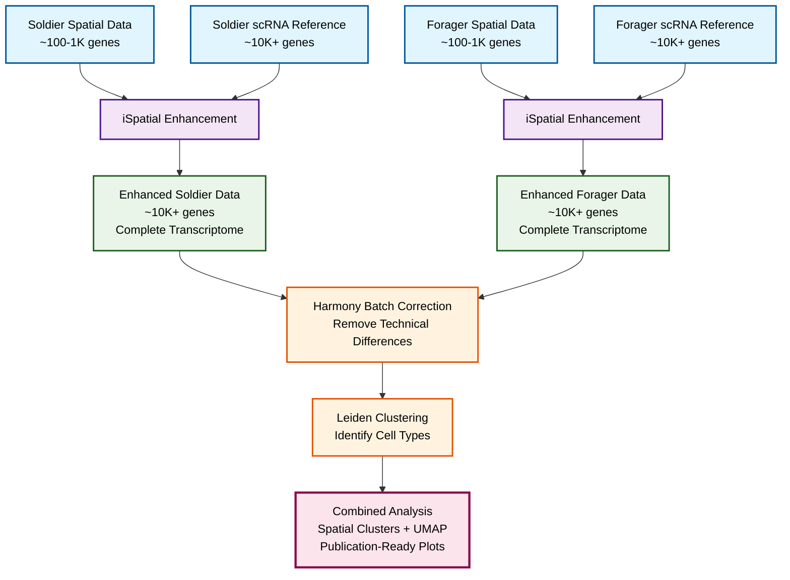

# iSpatial_py: Python Implementation of iSpatial

A Python reimplementation of the iSpatial R package for integrating single-cell RNA sequencing (scRNA-seq) and spatial transcriptomics data to enhance spatial gene expression profiles.

## Key Innovation: Complete Gene Expression Inference

**🚀 Major Enhancement:** Unlike the original iSpatial method, this Python implementation generates **complete scRNA-seq expression profiles** for all spatial cells by averaging the nearest single-cell neighbors' gene expression. This means:

- **Gene Expansion**: Transform spatial data from ~100-1000 measured genes to **10,000+ inferred genes**
- **Complete Transcriptome**: Each spatial cell receives expression values for ALL genes present in the scRNA-seq reference
- **Direct Inference**: Uses average expression from k-nearest scRNA-seq neighbors rather than just enhancing overlapping genes

This approach provides researchers with vastly expanded gene coverage while maintaining spatial context, enabling comprehensive downstream analyses that were previously impossible with limited spatial gene panels.

## Overview

iSpatial_py provides a comprehensive toolkit for spatial transcriptomics data analysis by leveraging information from single-cell RNA sequencing datasets. The package enables researchers to enhance spatial gene expression measurements by borrowing information from high-quality scRNA-seq data through advanced integration techniques.

## Key Features

- **Multi-modal Integration**: Seamlessly combine spatial transcriptomics and scRNA-seq data
- **Batch Correction**: Harmony-based integration to handle technical differences between datasets
- **Expression Enhancement**: Improve spatial gene expression profiles using KNN-based inference
- **Expression Stabilization**: Reduce noise through neighborhood-based smoothing
- **Flexible Inference Methods**: Multiple algorithms including harmony-based and PCA-based approaches
- **Parameter Optimization**: Tools to recommend optimal parameters for your datasets

## Complete Analysis Workflow

This package provides a **two-step workflow** for comprehensive spatial transcriptomics analysis:

### Step 1: iSpatial Enhancement (`iSpatial_py_run.py`)
Enhance individual spatial datasets using scRNA-seq references to infer complete gene expression profiles.

```bash
# Run iSpatial enhancement for individual samples
python iSpatial_py_run.py --spatial soldier_data.h5ad --scrna soldier_scrna.h5ad --out soldier_enhanced.h5ad
python iSpatial_py_run.py --spatial forager_data.h5ad --scrna forager_scrna.h5ad --out forager_enhanced.h5ad
```

**What it does:**
- Takes spatial data (~100-1000 genes) + scRNA-seq reference (~10,000+ genes)
- Outputs enhanced spatial data with complete gene expression profiles
- Each spatial cell receives expression values for ALL genes from scRNA-seq reference

### Step 2: Harmony Batch Correction & Clustering (`spatial_analysis_tools.py`)
Combine enhanced datasets from multiple samples/conditions with batch correction and clustering.

```python
from spatial_analysis_tools import combine_soldier_forager_with_clustering

# Combine enhanced datasets with Harmony batch correction
combined_adata = combine_soldier_forager_with_clustering(
    soldier_path="soldier_enhanced.h5ad",
    forager_path="forager_enhanced.h5ad",
    output_path="combined_soldier_forager_harmony.h5ad",
    apply_harmony=True,
    run_clustering=True,
    input_is_log_transformed=True  # Important: enhanced data is already log-transformed
)
```

**What it does:**
- Combines multiple enhanced spatial datasets
- Applies Harmony batch correction to remove technical differences
- Performs Leiden clustering to identify spatial cell types
- Generates comprehensive visualization plots

### Complete Pipeline Summary



### Quick Start: Complete Workflow

```bash
# Step 1: Enhance each dataset separately
python iSpatial_py_run.py --spatial data/soldier.h5ad --scrna data/soldier_scrna.h5ad --out enhanced_soldier.h5ad
python iSpatial_py_run.py --spatial data/forager.h5ad --scrna data/forager_scrna.h5ad --out enhanced_forager.h5ad

# Step 2: Combine with batch correction (Python script)
python -c "
from spatial_analysis_tools import combine_soldier_forager_with_clustering, plot_complete_analysis_results

# Combine and analyze
adata = combine_soldier_forager_with_clustering(
    'enhanced_soldier.h5ad', 
    'enhanced_forager.h5ad',
    output_path='final_combined_analysis.h5ad',
    input_is_log_transformed=True
)

# Generate comprehensive plots
plot_complete_analysis_results(adata, save_path='analysis_plots/')
"
```

## Installation

### Prerequisites

```bash
pip install scanpy anndata numpy scipy pandas scikit-learn harmonypy
```

### Core Dependencies

- `scanpy`: Single-cell analysis toolkit
- `anndata`: Annotated data structures
- `numpy`: Numerical computing
- `scipy`: Scientific computing (sparse matrices)
- `pandas`: Data manipulation
- `scikit-learn`: Machine learning utilities
- `harmonypy`: Batch correction algorithm

## Quick Start

### For Complete Workflow (Recommended)
See the **Complete Analysis Workflow** section above for the two-step pipeline combining iSpatial enhancement with Harmony batch correction.

### For Basic iSpatial Enhancement Only

```python
import scanpy as sc
import anndata as ad
from iSpatial_py import infer, stabilize_expr, recommend_k

# Load your data
spatial_data = sc.read_h5ad("spatial_data.h5ad")
scrna_data = sc.read_h5ad("scrna_data.h5ad")

# Basic integration
enhanced_spatial = infer(
    spRNA=spatial_data,
    scRNA=scrna_data,
    k_neighbor=30,
    dims=list(range(30))
)

# Access enhanced expression
enhanced_expression = enhanced_spatial.layers["enhanced"]
```

### For Command Line Usage

```bash
# Enhance a single spatial dataset
python iSpatial_py_run.py \
    --spatial path/to/spatial.h5ad \
    --scrna path/to/scrna_reference.h5ad \
    --out path/to/enhanced_output.h5ad
```

## Main Functions

### Core Integration Functions

#### `infer(spRNA, scRNA, **kwargs)`
Main integration function that enhances spatial expression using scRNA-seq data.

**Parameters:**
- `spRNA`: AnnData object with spatial transcriptomics data
- `scRNA`: AnnData object with single-cell RNA-seq data
- `dims`: Principal components to use (default: 0-29)
- `k_neighbor`: Number of neighbors for inference (default: 30)
- `infered_layer`: Name for enhanced expression layer (default: "enhanced")
- `include_all_sc_genes`: Include all scRNA genes in output (default: True)

**Returns:** Enhanced spatial AnnData object

#### `stabilize_expr(adata, neighbor=5, **kwargs)`
Stabilizes gene expression using KNN-based smoothing.

**Parameters:**
- `adata`: AnnData object to stabilize
- `neighbor`: Number of neighbors for smoothing
- `weight_NN`: Weight for neighbor contribution (default: 0.2)

### Batch Correction

#### `run_harmony(adata, genes_select, **kwargs)`
Applies Harmony batch correction for integrating datasets.

**Parameters:**
- `adata`: Combined AnnData object
- `genes_select`: Genes to use for integration
- `npc`: Number of principal components (default: 20)
- `batch_key`: Batch identifier column (default: "tech")

### Alternative Methods

#### `infer_rPCA(spRNA, scRNA, **kwargs)`
PCA-based integration without Harmony correction.

#### `infer_harmony(spRNA, scRNA, **kwargs)`
Alias for the main `infer` function with Harmony integration.

### Utilities

#### `recommend_k(spRNA, scRNA, **kwargs)`
Recommends optimal k values for neighbor-based inference.

#### `sparse_cor(x)`
Computes correlation matrix for sparse gene expression data.

## Spatial Analysis Tools Functions (`spatial_analysis_tools.py`)

### Dataset Combination and Batch Correction

#### `combine_soldier_forager_datasets(soldier_path, forager_path, **kwargs)`
Combines enhanced spatial datasets with optional Harmony batch correction.

**Parameters:**
- `soldier_path`: Path to enhanced soldier h5ad file
- `forager_path`: Path to enhanced forager h5ad file  
- `output_path`: Path to save combined dataset (optional)
- `apply_harmony`: Whether to apply Harmony batch correction (default: True)
- `input_is_log_transformed`: Whether input data is already log-transformed (default: True)
- `n_pcs`: Number of principal components for Harmony (default: 30)
- `harmony_theta`: Harmony theta parameter (default: 2.0)

#### `combine_soldier_forager_with_clustering(soldier_path, forager_path, **kwargs)`
Complete pipeline: combines datasets, applies Harmony, and performs Leiden clustering.

**Additional Parameters:**
- `run_clustering`: Whether to run Leiden clustering (default: True)
- `leiden_resolution`: Resolution for Leiden clustering (default: 0.2)

**Returns:** Combined AnnData object with batch correction and clustering results

### Visualization Functions

#### `plot_complete_analysis_results(adata, **kwargs)`
Creates comprehensive 16-panel visualization including UMAP, spatial plots, and statistics.

#### `plot_spatial_clusters(adata, **kwargs)`
Generates spatial cluster visualizations for combined and individual datasets.

#### `plot_batch_correction_results(adata, **kwargs)`
Visualizes batch correction effectiveness and clustering results.

#### `analyze_combined_data(adata, **kwargs)`
Provides detailed analysis summary with statistics and optional plots.

### Key Parameters for Log-Transformed Data
**Important:** When using enhanced data from `iSpatial_py_run.py`, always set:
```python
input_is_log_transformed=True
```
This prevents double normalization/transformation that can corrupt results.

## Usage Examples

### Complete Two-Step Workflow (Recommended)

```python
# ===== STEP 1: iSpatial Enhancement =====
# Run via command line for each sample:
# python iSpatial_py_run.py --spatial soldier_spatial.h5ad --scrna soldier_scrna.h5ad --out soldier_enhanced.h5ad
# python iSpatial_py_run.py --spatial forager_spatial.h5ad --scrna forager_scrna.h5ad --out forager_enhanced.h5ad

# ===== STEP 2: Harmony Batch Correction & Clustering =====
from spatial_analysis_tools import combine_soldier_forager_with_clustering, plot_complete_analysis_results

# Combine enhanced datasets with full pipeline
combined_adata = combine_soldier_forager_with_clustering(
    soldier_path="soldier_enhanced.h5ad",
    forager_path="forager_enhanced.h5ad", 
    output_path="final_combined_analysis.h5ad",
    apply_harmony=True,
    run_clustering=True,
    leiden_resolution=0.2,
    harmony_theta=2.0,
    input_is_log_transformed=True  # Critical: enhanced data is already log-transformed
)

# Generate comprehensive analysis plots
plot_complete_analysis_results(
    combined_adata,
    cluster_key='clusters',
    save_path='analysis_plots/'
)

# Access results
print(f"Total cells: {combined_adata.n_obs}")
print(f"Total genes: {combined_adata.n_vars}")
print(f"Clusters found: {len(combined_adata.obs['clusters'].unique())}")

# Cluster composition
cluster_stats = combined_adata.obs.groupby(['clusters', 'source']).size().unstack(fill_value=0)
print(cluster_stats)
```

### Basic Integration

```python
# Load data
spatial_adata = sc.read_h5ad("merfish_data.h5ad")
scrna_adata = sc.read_h5ad("scrna_reference.h5ad")

# Perform integration
result = infer(
    spRNA=spatial_adata,
    scRNA=scrna_adata,
    k_neighbor=30,
    dims=list(range(20)),
    include_all_sc_genes=True
)

# The result contains:
# - Enhanced expression in result.X
# - Original spatial expression in result.layers['original_spatial']
# - Enhanced expression also in result.layers['enhanced']
```

### With Expression Stabilization

```python
# Apply stabilization before integration
result = infer(
    spRNA=spatial_adata,
    scRNA=scrna_adata,
    correct_spRNA=True,
    correct_scRNA=True,
    correct_neighbor=5,
    correct_weight_NN=0.2
)
```

### Parameter Optimization

```python
# Find optimal k value
k_recommendations = recommend_k(
    spRNA=spatial_adata,
    scRNA=scrna_adata,
    k_neighbor=[10, 20, 30, 40, 50]
)
print(k_recommendations)
```

### PCA-based Integration

```python
# Use PCA instead of Harmony
result_pca = infer_rPCA(
    spRNA=spatial_adata,
    scRNA=scrna_adata,
    k_neighbor=30,
    weighted_KNN=True,
    RNA_weight=0.5
)
```

## Advanced Usage

### Custom Gene Selection

```python
# Integration with specific gene subset
common_genes = list(set(spatial_adata.var_names) & set(scrna_adata.var_names))
hvg_genes = common_genes[:2000]  # Use top 2000 genes

result = infer(
    spRNA=spatial_adata,
    scRNA=scrna_adata,
    dims=list(range(30)),
    k_neighbor=30
)
```

### Weighted Integration

```python
# Adjust weights between spatial and scRNA data
result = infer_rPCA(
    spRNA=spatial_adata,
    scRNA=scrna_adata,
    RNA_weight=0.7,  # Higher weight on scRNA data
    weighted_KNN=True
)
```

## Data Requirements

### Spatial Data (spRNA)
- AnnData object with spatial coordinates
- Gene expression matrix (preferably raw or minimally processed)
- Spatial coordinates in `.obsm['spatial']` (recommended)

### Single-cell Data (scRNA)
- AnnData object with single-cell profiles
- High-quality gene expression measurements
- Ideally from the same tissue/organism as spatial data

### Gene Compatibility
- Genes should use consistent naming between datasets
- The package automatically handles gene intersection
- Placeholder genes starting with "barcode_" are automatically removed

## Data Preprocessing Recommendations

For optimal integration results, we recommend preprocessing your data as follows:

### Spatial RNA-seq Data (spRNA)
- **Cell Size Normalization**: Normalize by cell area or volume to account for varying cell sizes
- **Quality Control**: Remove cells with very low gene counts or outlier expression patterns
- **Raw or Log-Transformed**: Can work with raw counts or log-transformed data

```python
# Example cell size normalization for spatial data
spatial_adata.obs['cell_area'] = calculate_cell_area(spatial_coordinates)
sc.pp.normalize_total(spatial_adata, target_sum=None)  # Normalize by cell size
# Or manually: spatial_adata.X = spatial_adata.X / spatial_adata.obs['cell_area'].values[:, None]
```

### Single-cell RNA-seq Data (scRNA)
- **CPM Normalization**: Counts per million normalization to standardize library sizes
- **Quality Control**: Standard scRNA-seq QC (remove low-quality cells, doublets, etc.)
- **Log Transformation**: Log1p transformation after normalization

```python
# Example CPM normalization for scRNA data
sc.pp.normalize_total(scrna_adata, target_sum=1e6)  # CPM normalization
sc.pp.log1p(scrna_adata)  # Log transformation

# Alternative manual CPM
# scrna_adata.X = (scrna_adata.X / scrna_adata.X.sum(axis=1)[:, None]) * 1e6
```

### General Preprocessing Notes
- **Gene Filtering**: Remove genes expressed in very few cells
- **Batch Effects**: If data comes from multiple batches, consider batch correction
- **Consistent Processing**: Apply similar QC criteria to both datasets when possible

## Output Structure

The enhanced spatial data includes:

- **`.X`**: Enhanced gene expression matrix (primary output)
- **`.layers['enhanced']`**: Copy of enhanced expression
- **`.layers['original_spatial']`**: Original spatial expression (for comparison)
- **`.obs`**: Original spatial metadata
- **`.var`**: Gene information (expanded if `include_all_sc_genes=True`)

## Best Practices

1. **Quality Control**: Ensure both datasets are properly quality-controlled
2. **Gene Filtering**: Remove low-quality genes before integration
3. **Parameter Tuning**: Use `recommend_k()` to optimize neighbor counts
4. **Validation**: Compare original and enhanced expression for key genes
5. **Memory Management**: For large datasets, consider processing in batches

## Troubleshooting

### Common Issues

**Error: "Too few intersected genes"**
- Ensure gene names are consistent between datasets
- Check for different gene ID formats (symbols vs. ensembl IDs)

**Memory Errors**
- Reduce the number of cells or genes
- Use `include_all_sc_genes=False` to limit output size

**Poor Integration Results**
- Try different k values using `recommend_k()`
- Enable expression stabilization with `correct_spRNA=True`
- Adjust integration dimensions

### Two-Step Workflow Issues

**No difference between `input_is_log_transformed=True` and `False`**
- This indicates your input data may not be properly prepared
- Verify that Step 1 (iSpatial enhancement) completed successfully
- Check that enhanced files contain the expected gene counts

**Batch correction not working**
- Ensure `input_is_log_transformed=True` when using enhanced data from `iSpatial_py_run.py`
- Verify that both datasets have similar cell counts and gene expression ranges
- Try adjusting `harmony_theta` parameter (lower values = less correction)

**Clustering gives too many/few clusters**
- Adjust `leiden_resolution` parameter (higher = more clusters, lower = fewer clusters)
- Typical range: 0.1-1.0, start with 0.2-0.5

**Visualization plots are empty or incorrect**
- Check that spatial coordinates exist in `.obsm['spatial']`
- Verify that clustering completed successfully (`'clusters'` in `.obs`)
- Ensure UMAP was computed (should happen automatically with Harmony)

## Contributing

Contributions are welcome! Please feel free to submit issues, feature requests, or pull requests.

## Support

For questions and support, please refer to the documentation or create an issue in the repository. 